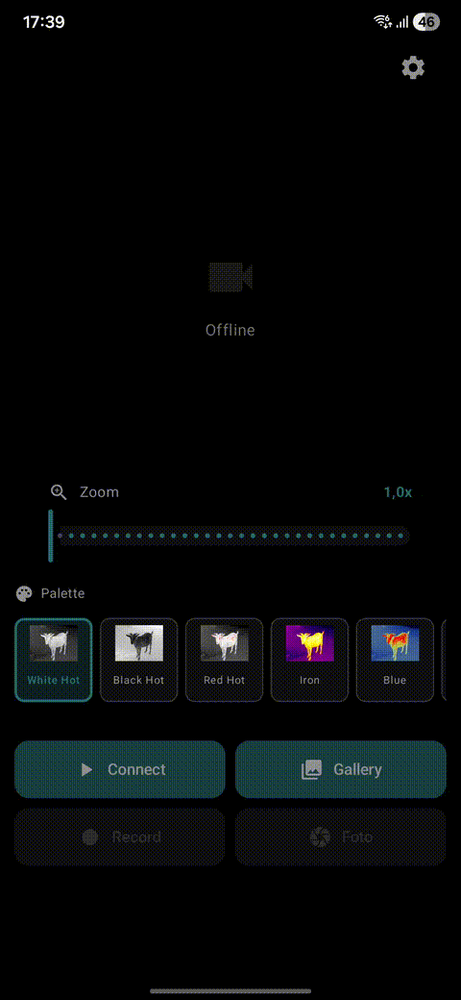

# NoxVision

[](https://opensource.org/licenses/MIT)
[](https://developer.android.com)
[](https://kotlinlang.org)

**Open Source Android App for Guide Thermal Cameras with AI Object Detection**

A powerful alternative to the official Guide app, specifically designed for the [Guide TE211M](https://de.guideoutdoor.com/produkt/wärmebild-monokulare/te-serie/te211m) Thermal Monocular.

---

## 📺 Demo

<p align="center">
  
</p>

---

## ✨ Features

- 🎥 **Live Thermal Video Stream** via RTSP (LibVLC)
- 🤖 **YOLO Object Detection** with TensorFlow Lite
- 🎨 **Multiple Palettes**: Whitehot, Blackhot, Bluehot, Greenhot, Ironred, and more
- 📸 **Screenshot & Video Recording** with gallery storage
- 📁 **Integrated Gallery** for captured media
- 📶 **Auto-WiFi Connect** to camera
- ⚡ **Real-time Overlay** with bounding boxes and labels
- 🌙 **Dark Theme** optimized for night use

## 📱 Supported Devices

### Thermal Cameras
- **Guide TE211M** (primarily tested)
- Other Guide TE-Series cameras (should be compatible)
- Cameras with RTSP stream on `192.168.42.1:8554`

### Android
- **Minimum**: Android 7.0 (API 24)
- **Target**: Android 15 (API 35)
- **Architecture**: arm64-v8a

## 🔧 Camera Connection

The app automatically connects to the camera via WiFi:

| Parameter | Default Value | Description |
|-----------|---------------|-------------|
| **SSID** | `TE Mini-XXXX` | Camera's WiFi hotspot |
| **Password** | `12345678` | Default password for all Guide TE cameras |
| **IP** | `192.168.42.1` | Fixed IP of camera in hotspot mode |
| **RTSP** | `rtsp://192.168.42.1:8554/video` | Video stream URL |
| **HTTP API** | `http://192.168.42.1` | Camera control |

> **Note**: The credentials are identical for all Guide TE cameras and cannot be changed.

## 📥 Installation

### Option 1: APK Download (Recommended)
1. Download the latest APK from [Releases](../../releases)
2. Install on your Android device
3. Allow installation from unknown sources if prompted

### Option 2: Build from Source

**Prerequisites:**
- JDK 17 or higher
- Android SDK (API 35)
- Git

```bash
# Clone repository
git clone https://github.com/marcgrox22-lgtm/NoxVision.git
cd NoxVision

# Set SDK path (if not auto-detected)
echo "sdk.dir=/path/to/Android/Sdk" > local.properties

# Build debug APK
./gradlew assembleDebug

# APK location:
# app/build/outputs/apk/debug/NoxVision-v1.0-debug.apk
```

**With VS Code (without Android Studio):**
```bash
# Open terminal and build
./gradlew assembleDebug

# Transfer APK via LocalSend, ADB, or USB to your device
```

## 🎯 Usage

1. **Turn on camera** and enable WiFi hotspot
2. **Launch app** - automatically connects to camera
3. **Live stream** displays with object detection
4. **Controls**:
   - 📷 Take screenshot
   - 🎬 Record video
   - 🎨 Change palette
   - 📁 Open gallery

## 🧠 Object Detection

The app uses a trained TensorFlow Lite model for thermal detection:

| File | Description |
|------|-------------|
| `detect.tflite` | TFLite model (YOLO-based) |
| `labelmap.txt` | Class labels (person, vehicle, etc.) |

The model is specifically trained for thermal images and detects people and vehicles in thermal imagery.

## 🛠️ Development

### Project Structure
```
app/src/main/
├── java/com/noxvision/app/
│   ├── MainActivity.kt      # Main app logic
│   └── ui/theme/            # Compose Theme
├── assets/
│   ├── detect.tflite        # AI model
│   └── labelmap.txt         # Classes
└── res/
    ├── drawable/            # Palette images
    └── values/              # Strings, Colors
```

### Tech Stack
- **Language**: Kotlin 2.0
- **UI**: Jetpack Compose
- **Video**: LibVLC
- **AI**: TensorFlow Lite
- **HTTP**: OkHttp
- **Images**: Coil

### Build Variants
```bash
# Debug (for testing)
./gradlew assembleDebug

# Release (for distribution)
./gradlew assembleRelease
```

## 🤝 Contributing

Contributions are welcome! See [CONTRIBUTING.md](CONTRIBUTING.md) for details.

### Branches
- `main` - Stable version
- `beta` - Development & new features

## 📋 Roadmap

- [ ] Settings screen for camera IP
- [ ] Support for additional camera models
- [ ] Export to video formats
- [ ] Improved AI model
- [ ] Multi-language support

## ❓ FAQ

**Q: Why this app instead of the official Guide app?**
> The official app has performance issues and missing features. This open-source alternative offers better performance and AI detection.

**Q: Does the app work with other thermal cameras?**
> In principle yes, if they support RTSP streaming. The IP address may need to be adjusted in the code.

**Q: Do I need Android Studio?**
> No! You can build the APK with VS Code and Gradle. See Installation above.

## 📄 License

[MIT License](LICENSE) - You can freely use, modify, and distribute the app.

## 🙏 Credits

- [Guide Sensmart](https://de.guideoutdoor.com) for the hardware
- [LibVLC](https://www.videolan.org/vlc/libvlc.html) for video streaming
- [TensorFlow Lite](https://www.tensorflow.org/lite) for AI inference

---

**⭐ If you like this project, give it a star!**
