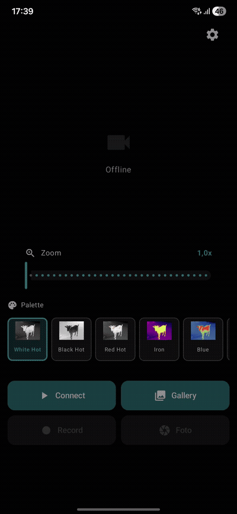

# NoxVision

Android companion app for [Guide Sensmart](https://guideir-thermal.com) thermal cameras. Connects over Wi-Fi via RTSP streaming and the camera HTTP REST API.

**[☕ Support NoxVision on Ko-fi](https://ko-fi.com/nacl_dev)**

**[Google Play](https://play.google.com/store/apps/details?id=com.noxvision.app)** · [FAQ](docs/FAQ.md) · [Device Reticle Support](docs/device-reticle-support.md) · [Support NoxVision](docs/SUPPORT.md) · [Privacy Policy](PRIVACY_POLICY.md) · [Issues](https://github.com/nacl-dev/NoxVision/issues)

## Overview

NoxVision provides live thermal streaming, camera controls, and field tools for Guide devices. It is an independent application — not affiliated with Guide Infrared or their official app — with its own UI, hunting assistant, on-device object detection, and offline maps.

A focus of the project is **reliable camera connection**: one-tap WiFi pairing, stable RTSP streaming, and reconnect when returning to the app.

The app is available on Google Play. End users should install from the store; GitHub builds are intended for development and troubleshooting.

## Features

**Connection**

- In-app WiFi auto-connect to the camera hotspot (Android 10+; SSID and password stored in Settings → Connection)
- Process-bound to the camera network so streaming and REST control use the same link
- RTSP over TCP with tuned buffering for a stable live view in the field
- Stream resumes automatically when the app returns to the foreground

**Streaming & camera control**

- RTSP live view from Guide camera hotspots (default `192.168.42.1`)
- Palette, brightness, contrast, zoom, audio, and hotspot controls
- Thermal measurement settings (emissivity, distance, humidity, NUC shutter)
- Screenshots and video recording with in-app gallery
- On-device AI object detection (optional)

**Hunting assistant**

- Shot documentation and journal entries
- Weather via OpenWeather API
- Hunting calendar and season tracking
- Offline maps, waypoints, and compass navigation

**App crosshair**

- Stream overlay crosshair (all supported models)
- Hardware device reticle on models that support it — see [Device Reticle Support Guide](docs/device-reticle-support.md)

**Localization:** German, English, French, Spanish, Italian, Dutch, Polish, Ukrainian

## Supported cameras

NoxVision targets Guide Sensmart thermal cameras. Compatibility varies by model and firmware.

| Series | Examples                                          | Notes                                      |
| ------ | ------------------------------------------------- | ------------------------------------------ |
| TE     | TE211M (primary test device), TE211, TE411, TE421 | Monoculars; TE211M has no hardware reticle |
| C      | C400, C640, C800                                  | Handheld                                   |
| D      | D160, D192, D384, D400                            | Industrial modules                         |
| B      | B160, B256, B320                                  | Entry-level modules                        |
| PS     | PS series                                         | Compact models                             |

Cameras that expose RTSP at `192.168.42.1:8554` typically work for streaming. Advanced features depend on the specific model and firmware. See the [FAQ](docs/FAQ.md) for details.

## Project status

|                  |                                                                                             |
| ---------------- | ------------------------------------------------------------------------------------------- |
| **Version**      | 2.0.0 (`versionCode` 5)                                                                     |
| **Distribution** | [Google Play](https://play.google.com/store/apps/details?id=com.noxvision.app) (production) |
| **License**      | MIT                                                                                         |

## Support NoxVision

NoxVision is free and open source.

Because NoxVision communicates directly with physical thermal cameras, continued development and compatibility testing require access to the actual hardware. Thermal cameras are expensive, and as an independent developer it is not practical to purchase every supported model personally.

Community support helps make it possible to acquire additional hardware for development, testing, debugging, and future compatibility.

**Your support can help fund:**

- Thermal cameras for compatibility testing
- Hardware required to support additional Guide models
- Android test devices and accessories
- Development and testing infrastructure
- Continued maintenance and new features

### Support the project

**[☕ Support NoxVision on Ko-fi](https://ko-fi.com/nacl_dev#)**

For more information about community support and how future hardware priorities are determined, see the [Hardware & Community Support](docs/SUPPORT.md) page.

NoxVision remains free and open source regardless of whether you contribute.

## Documentation

- [FAQ](docs/FAQ.md) — downloads, compatibility, and troubleshooting
- [Device Reticle Support Guide](docs/device-reticle-support.md) — hardware reticle support and testing
- [Support & Hardware Fund](docs/SUPPORT.md) — current development hardware goals and funding
- [Contributing Guide](CONTRIBUTING.md)
- [Privacy Policy](PRIVACY_POLICY.md)

## Contributing

Bug reports and feature requests: [GitHub Issues](https://github.com/nacl-dev/NoxVision/issues)

When reporting a bug, please include the camera model, firmware version, Android device, Android version, NoxVision version, and steps to reproduce the issue where possible.

Contributions: see [CONTRIBUTING.md](CONTRIBUTING.md)

## License

MIT — see [LICENSE](LICENSE).

## Disclaimer

NoxVision is an independent open-source project and is **not affiliated with, endorsed by, or sponsored by Guide Sensmart / Guide Infrared**.

Camera functionality can vary between models and firmware versions. Features described as experimental or model-dependent should be verified on the actual camera hardware.